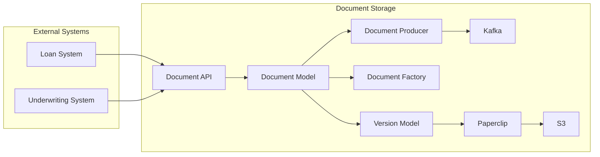

**Legend:**

* **Document Storage:** This represents the core microservice responsible for managing documents and their versions.
* **Document API:** This is the RESTful API that exposes endpoints for creating, retrieving, updating, and deleting documents and versions.
* **Document Model:** This is the Ruby model representing a document, which includes attributes like subject ID, subject type, category, year, country code, and owner.
* **Version Model:** This is the Ruby model representing a version of a document, which includes attributes like file, file fingerprint, uploaded by, reason, and version.
* **Document Factory:** This is a utility class responsible for creating new documents and their initial versions.
* **Document Producer:** This is a class responsible for publishing document events to Kafka.
* **Kafka:** This is the message queue used for asynchronous communication between the Document Storage microservice and other systems.
* **Paperclip:** This is a Ruby gem used for managing file uploads and storage.
* **S3:** This is the cloud storage service used for storing document files.
* **Loan System:** This is an external system that interacts with the Document Storage microservice to store documents related to loans.
* **Underwriting System:** This is an external system that interacts with the Document Storage microservice to access and update document versions.

**Explanation:**

* The Document API provides a RESTful interface for external systems to interact with the Document Storage microservice.
* The Document Model and Version Model represent the core data structures for documents and their versions.
* The Document Factory simplifies the creation of new documents and versions.
* The Document Producer publishes document events to Kafka, enabling asynchronous communication with other systems.
* Paperclip handles file uploads and storage, leveraging S3 for persistent storage.
* External systems like the Loan System and Underwriting System interact with the Document API to manage documents and versions.

This architecture diagram provides a high-level overview of the Document Storage microservice and its interactions with external systems. It highlights the key components and their relationships, providing a foundation for understanding the codebase.
