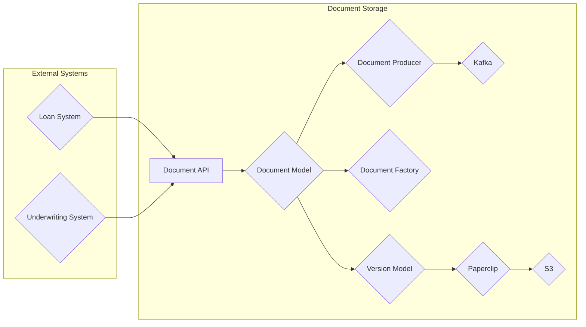

## Document Storage Microservice Architecture

**Current Time:** 2023-10-26T15:32:12.849522+00:00

**Author:** Bard

**Diagram:**

**Components:**

* **Document API:** RESTful API for managing documents and versions.
* **Document Model:** Represents a document with attributes like subject, category, year, and owner.
* **Version Model:** Represents a specific version of a document, including the file content and metadata.
* **Document Factory:** Creates new documents and versions based on provided parameters.
* **Document Producer:** Publishes document events to Kafka.
* **Kafka:** Message queue for asynchronous communication.
* **Paperclip:** Library for managing file uploads and storage.
* **S3:** Cloud storage service for storing document files.
* **Loan System:** External system providing document subjects.
* **Underwriting System:** External system interacting with documents.

**Data Flow:**

1. External systems (Loan System, Underwriting System) interact with the Document API.
2. The Document API interacts with the Document Model and Version Model to create, retrieve, update, and delete documents and versions.
3. The Document Factory creates new documents and versions based on API requests.
4. The Document Producer publishes document events to Kafka.
5. Paperclip handles file uploads and storage in S3.

**Key Features:**

* **Microservice Architecture:** The Document Storage is a self-contained microservice responsible for managing documents and versions.
* **Asynchronous Communication:** Kafka enables asynchronous communication between the Document Storage and external systems.
* **Cloud Storage:** S3 provides scalable and secure storage for document files.
* **Versioning:** The Version Model allows for tracking different versions of a document.
* **Data Validation:** The Document Model and Version Model enforce data integrity through validations.

**Refactoring Considerations:**

* **Event-Driven Architecture:** Further leverage Kafka for event-driven communication between microservices.
* **Domain-Driven Design:** Apply DDD principles to better model the domain and improve code organization.
* **API Versioning:** Implement API versioning to support future changes without breaking existing clients.
* **Security:** Implement robust security measures for API authentication and data protection.
* **Monitoring and Logging:** Implement monitoring and logging to track system performance and identify issues.
