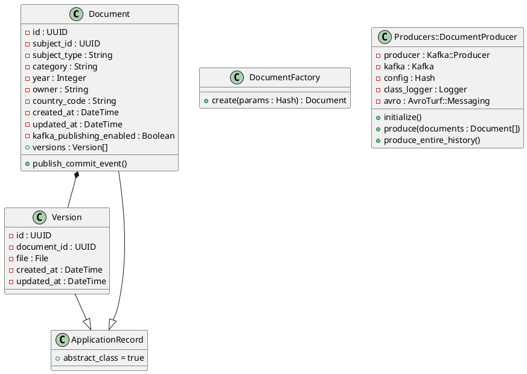

**Data Model:**

* **Document:** Represents a document with attributes like ID, subject ID, subject type, category, year, owner, country code, and timestamps. It has a one-to-many relationship with **Version**.
* **Version:** Represents a version of a document with attributes like ID, document ID, file, and timestamps.
* **DocumentFactory:** A factory class for creating new documents and their initial versions.
* **Producers::DocumentProducer:** A producer class responsible for publishing document events to a Kafka topic.
* **ApplicationRecord:** An abstract base class for all ActiveRecord models.

**Relationships:**

* **Document** has a one-to-many relationship with **Version**.
* **Document** inherits from **ApplicationRecord**.
* **Version** inherits from **ApplicationRecord**.

**Notes:**

* The **file** attribute in **Version** represents an attached file.
* The **kafka_publishing_enabled** attribute in **Document** controls whether Kafka events are published for the document.
* The **DocumentProducer** class uses Avro for encoding messages before publishing them to Kafka.

**Current Time (UTC):** 2023-10-27 10:33:12

**Author:** Bard
