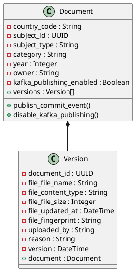

```plantuml
@startuml
class Document {
    - country_code : String
    - subject_id : UUID
    - subject_type : String
    - category : String
    - year : Integer
    - owner : String
    - kafka_publishing_enabled : Boolean
    + publish_commit_event()
    + disable_kafka_publishing()
    + versions : Version[]
}

class Version {
    - document_id : UUID
    - file_file_name : String
    - file_content_type : String
    - file_file_size : Integer
    - file_updated_at : DateTime
    - file_fingerprint : String
    - uploaded_by : String
    - reason : String
    - version : DateTime
    + document : Document
}

Document *-- Version
@enduml
```